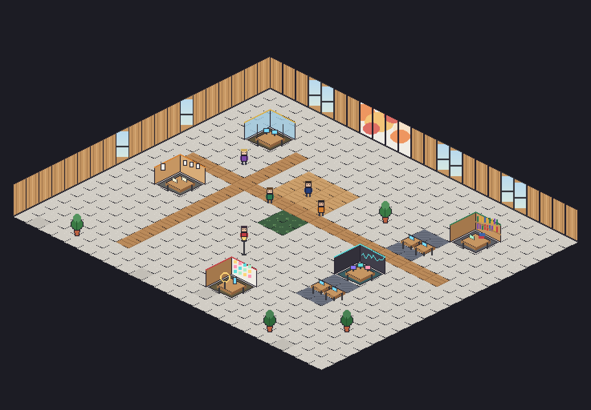
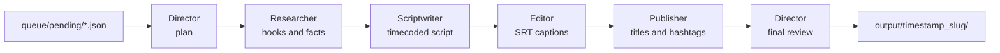

# Agent Town

An ambient 16-bit isometric creative-studio office, built in **Godot 4**, where a
crew of AI agents produces short-form video content (Reels / TikTok / Shorts) for
real. One big room — wood-clad walls, tall windows, a mural wall, carpet and
timber walkways — modeled after a modern open-plan studio.

Drop a request file into a folder — the **Director** picks it up, writes a brief,
and cascades the work through **Researcher → Scriptwriter → Editor → Publisher**,
each powered by a live **Claude API** call. Agents walk to their rooms, work at
their desks, chat in speech bubbles, and the finished reel package lands on your
disk. No clicking required. You just watch the town live.



## How it works



Every stage is a real Claude Messages API call (or canned demo text in simulate
mode). The pipeline waits for each agent to physically walk to its workstation
before the call fires — the town state is the pipeline state.

| Agent | Workstation | Deliverable |
|---|---|---|
| Director | Glass corner office by the mural | `00_plan.md`, `05_review.md` |
| Researcher | Bookshelf research corner | `01_research.md` |
| Scriptwriter | Writers' room (pinned pages) | `02_script.md` |
| Editor | Edit bay (waveform panel, 3 monitors) | `03_captions.srt` |
| Publisher | Publishing deck (sticky-note board, ring light) | `04_publish.md` |

The Editor follows the same caption rules as the `reels-pipeline` workflow:
~32 chars per caption, no mid-word breaks (Thai-aware), phrase-boundary
wrapping, blank during silence — so its SRT drops straight into an editor.

## Quick start

1. **Install Godot 4.3+** — download from [godotengine.org](https://godotengine.org/download) (no other dependencies needed to run).
2. **Clone and open**
   ```bash
   git clone https://github.com/<you>/agent-town.git
   ```
   Open the folder in Godot (Import → select `project.godot`) and press ▶.
3. **First run works instantly** — with no API key the town starts in **DEMO
   mode** (simulated content) and processes the included
   `queue/pending/welcome_reel.json` so you can watch the full cascade.
4. **Go live with Claude**
   ```bash
   cp user_config.example.cfg user_config.cfg
   # edit user_config.cfg and paste your Anthropic API key
   ```
   (or just set the `ANTHROPIC_API_KEY` environment variable). Restart the
   scene — the HUD shows `MODE: LIVE`.
5. **Feed the town** — drop a JSON file into `queue/pending/`:
   ```json
   {
     "topic": "วิธีตั้งกล้องถ่าย Reels ให้ดูโปร ด้วยมือถือเครื่องเดียว",
     "audience": "Beginner Thai creators",
     "duration_sec": 60,
     "platform": "Instagram Reels"
   }
   ```
   Only `topic` is required. Full schema in [`queue/README.md`](queue/README.md).

Results appear in `output/<timestamp>_<slug>/` — research notes, a timecoded
Thai/English script, caption-capped SRT subtitles, a publish package with
hashtags, and the Director's QC verdict.

## Configuration

`user_config.cfg` (gitignored — your key stays local):

| Key | Default | Meaning |
|---|---|---|
| `claude/api_key` | — | Anthropic API key (or `ANTHROPIC_API_KEY` env var) |
| `claude/model` | `claude-sonnet-5` | Model for all agents |
| `claude/max_tokens` | `3000` | Max tokens per stage |
| `town/poll_interval` | `4.0` | Queue polling seconds |
| `town/simulate` | `false` | Force demo mode (no API calls) |
| `content/language` | Thai + EN hooks | Output language for the crew |
| `content/niche` | Education / how-to | The channel's niche |

Per-request `language` / `niche` fields override the config.

## Project layout

```
agent-town/
├── project.godot            Godot 4 project (pixel-perfect rendering)
├── scenes/main.tscn         Single scene — everything is built in code
├── scripts/
│   ├── autoload/            Config, EventBus, Claude client, queue, writer
│   ├── pipeline.gd          The boss→subagent cascade
│   ├── prompts.gd           System prompts per role
│   ├── town.gd              Isometric renderer + A* pathfinding
│   ├── agent.gd             Agent FSM: wander / walk / work / speak
│   └── main.gd              Boot, camera, HUD
├── assets/                  Generated 16-bit pixel art + map.json
├── tools/generate_assets.py Deterministic art generator (Pillow)
├── tools/ci_check.gd        Headless validation (used by CI)
├── queue/                   pending/ → processing/ → done/
└── output/                  Finished reel packages
```

## Regenerating the art

All sprites, the campus map, and the README preview are generated by one
deterministic script — tweak the palette or map layout and re-run:

```bash
pip install pillow
python3 tools/generate_assets.py
```

## Controls

Pan with WASD / arrow keys, zoom with the mouse wheel. Everything else is
ambient — the town runs itself.

## CI

GitHub Actions validates every push with headless Godot 4.3: regenerates the
assets, imports resources, loads every script and scene, and verifies the map.

## Roadmap ideas

- Live web research for the Researcher (search API tool use)
- Hand-off to a rendering pipeline that burns the SRT into a vertical video
- Multiple concurrent requests with a visible task board in the atrium
- More crew: Analyst agent reading post performance and pitching topics

## License

[MIT](LICENSE)
